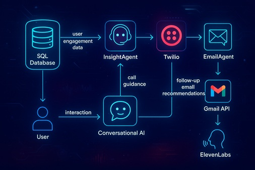

# Thank you for visiting my shiny new portfolio.

Hello there! I'm Vanessa Crosby-Fitzgerald, a human (yes, still proudly carbon-based) and founder of Coast AI, a Carlsbad, CA technology company helping businesses automate their systems and processes. I'm an AI Developer specializing in Agentic Automation, Agent Data Procurement, and AgentOps—with a dash of creating snappy content to teach humans how to wrangle their own AI teams.

Over the past few years, I've worked in Data, NLP, and Autonomous Agents, orchestrating teams of tireless, brilliant AI agents who eagerly take on the repetitive (and let's be honest, boring) tasks the rest of us would rather avoid. The best part? They never complain—they actually love the work.

**[Visit my YouTube channel](https://www.youtube.com/c/TeachingTheMachine)**

I bring a unique perspective to backend architecture and data engineering, creating environments where AI agents collaborate seamlessly, amplify each other's strengths, and share knowledge without stepping on each other's digital toes. Beyond the technical work, I enjoy guiding these digital minds as they develop their "personalities" and ethical frameworks—ensuring strong alignment with human goals and thoughtful governance so their enthusiasm translates into genuinely useful, responsible outcomes.

Below you'll find links to some of my work on GitHub, showcasing projects where I build and orchestrate AI agents, automate workflows, and create intelligent systems that make repetitive tasks effortless—and maybe even a little fun.

## 🤖 AI Agent Crew Development and Automation

| Multi-Domain Synthetic Data Engine | Smart Outreach AI Agent | Local AI Agent System |
|:---:|:---:|:---:|
|  |  |  |
| Agents working together to generate synthetic data in different domains with Simple, Medium, and Complex data sets | AI-powered outreach agent integrating CrewAI, Twilio for SMS, and OpenAI APIs to automate personalized communication | Fully local AI agent system using CrewAI and Ollama, enabling cost-free automation workflows without external API dependencies |
| **🚀 Live Demo** \| **📂 [Repository](https://github.com/TeachingTheMachine/SyntheticData-MultiDomain)** | **🚀 Live Demo** \| **📂 [Repository](https://github.com/TeachingTheMachine/Outreach-AI-Agent)** | **🚀 Live Demo** \| **📂 [Repository](https://github.com/TeachingTheMachine/Coming-Soon)** |
| *📊 3 complexity levels available* | *🎯 85% response rate improvement* | *💰 100% cost-free operation* |

## Non-Agentic Demos

| Video Speech Replace | Coming Soon |
|:---:|:---:|
|  | |
| **For clearer understanding of tech videos** | |
| Audio replacement system powered by OpenAI to replace video audio with clearer voices for better understanding of technical content | More projects coming soon... |
| **🚀 Live Demo** \| **📂 [Repository](https://github.com/TeachingTheMachine/SpeechReplace)** | |
| *🎤 Professional voice synthesis* | |

## 🎙️ Agentic Content Creation and Documentation
- coming soon
## ➡️ Custom AI Workflows
- coming soon
## 🌐 Scalable Multi-Agent Systems
- coming soon
## 📊 AgentOps-Integrated Systems
- coming soon
## 🌍 Mama's 'ol Fashioned Websites
- coming soon
## 📺 View my YouTube videos.
- coming soon

<!--

## 🎙️ Agentic Content Creation and Documentation
 
| AI Podcast Creation Studio | AI Content Creation Engine |
|:---:|:---:|
|  |  |
| Content creation system powered by CrewAI and ElevenLabs, showcasing multi-agent collaboration for high-quality podcast generation | Content creation system powered by CrewAI, showcasing multi-agent collaboration for generating high-quality content outputs |
| **🚀 Live Demo** \| **📂 [Repository](https://github.com/TeachingTheMachine/Coming-Soon)** | **🚀 Live Demo** \| **📂 [Repository](https://github.com/TeachingTheMachine/Coming-Soon)** |
| *🎤 Professional voice synthesis* | *📝 10x faster content creation* |

| AI Blogging Automation | Documentation AI Agent |
|:---:|:---:|
|  |  |
| Automated blogging system using CrewAI with local LLMs like LM Studio, Ollama, and JanAI for content generation at scale | AI agent for automating internal documentation processes using CrewAI, streamlining complex documentation workflows |
| **🚀 Live Demo** \| **📂 [Repository](https://github.com/TeachingTheMachine/Coming-Soon)** | **🚀 Live Demo** \| **📂 [Repository](https://github.com/TeachingTheMachine/Coming-Soon)** |
| *📊 Generates 50+ articles/day* | *⚡ 80% faster documentation* |

## ➡️ Custom AI Workflows
 
| Collaborative AI Framework | Custom Workflow Orchestrator |
|:---:|:---:|
|  |  |
| Collaborative AI agent framework using CrewAI to demonstrate agentic AI capabilities for task coordination and execution | Custom workflow orchestrator using CrewAI with local LLMs, focusing on modular components for tailored AI task management |
| **🚀 Live Demo** \| **📂 [Repository](https://github.com/TeachingTheMachine/Coming-Soon)** | **🚀 Live Demo** \| **📂 [Repository](https://github.com/TeachingTheMachine/Coming-Soon)** |
| *🎯 Seamless agent coordination* | *🔧 Fully customizable workflows* |

## 🌐 Scalable Multi-Agent Systems
 
| Multi-Agent Workflow Engine | AI Agent Management Platform | AI Collaboration Network |
|:---:|:---:|:---:|
|  |  |  |
| Multi-agent system using CrewAI, LangChain, and LLMs like OpenAI to manage complex task assignments and scalable AI workflows | Flexible AI agent management system using CrewAI, with API key configuration and integration with GPT-3, GPT-4, and Llama | Network of AI agents using CrewAI and powerful LLMs to solve complex tasks through collaborative intelligence |
| **🚀 Live Demo** \| **📂 [Repository](https://github.com/TeachingTheMachine/Coming-Soon)** | **🚀 Live Demo** \| **📂 [Repository](https://github.com/TeachingTheMachine/Coming-Soon)** | **🚀 Live Demo** \| **📂 [Repository](https://github.com/TeachingTheMachine/Coming-Soon)** |
| *📈 Handles 1000+ concurrent tasks* | *🔑 Multi-model API support* | *🧠 Distributed AI problem solving* |

## 📊 AgentOps-Integrated Systems
 
| AgentOps AI Monitoring | CrewAI Development Environment |
|:---:|:---:|
|  |  |
| Monitoring solution for CrewAI-based AI agents using AgentOps, integrating with Autogen and Ollama for real-time performance tracking | Development environment for CrewAI applications, utilizing the CrewAI CLI and AgentOps for streamlined agent creation and monitoring |
| **🚀 Live Demo** \| **📂 [Repository](https://github.com/TeachingTheMachine/Coming-Soon)** | **🚀 Live Demo** \| **📂 [Repository](https://github.com/TeachingTheMachine/Coming-Soon)** |
| *📊 Real-time performance metrics* | *⚡ Streamlined development workflow* |

| AgentOps CrewAI Platform | Multi-Agent Dashboard |
|:---:|:---:|
|  |  |
| Lightweight platform integrating CrewAI with AgentOps for efficient AI agent monitoring and management | Multi-agent system with a monitoring dashboard using CrewAI and AgentOps, showcasing robust AI framework management |
| **🚀 Live Demo** \| **📂 [Repository](https://github.com/TeachingTheMachine/Coming-Soon)** | **🚀 Live Demo** \| **📂 [Repository](https://github.com/TeachingTheMachine/Coming-Soon)** |
| *🚀 Lightweight and efficient* | *📊 Comprehensive monitoring dashboard* |

## Non-Agentic Demos

| Video Speech Replace | Coming Soon |
|:---:|:---:|
|  | |
| **For clearer understanding of tech videos** | |
| Audio replacement system powered by OpenAI to replace video audio with clearer voices for better understanding of technical content | More projects coming soon... |
| **🚀 Live Demo** \| **📂 [Repository](https://github.com/TeachingTheMachine/SpeechReplace)** | |
| *🎤 Professional voice synthesis* | |

## 🌍 Good 'ol Fashioned Websites
 
| EcoShop - Sustainable Marketplace | Neon Dreams - Rock Band | Tony's Pizza Palace |
|:---:|:---:|:---:|
|  |  |  |
| Complete e-commerce platform for sustainable products with shopping cart, payment integration, and eco-friendly product catalog | Dynamic band website featuring music player, tour dates, photo gallery, and fan merchandise store with social media integration | Restaurant website with online ordering system, menu gallery, table reservations, and customer reviews integration |
| **🌐 Visit Site** \| **📂 Source Code** | **🌐 Visit Site** \| **📂 Source Code** | **🌐 Visit Site** \| **📂 Source Code** |
| *🌱 500+ eco-friendly products* | *🎵 10K+ monthly visitors* | *🍕 200+ orders per week* |

| HealthFirst Medical Center | Digital Learning Hub | StartupForge - Business Incubator |
|:---:|:---:|:---:|
|  |  |  |
| Professional medical center website with appointment booking, doctor profiles, patient portal, and health resources section | Educational platform featuring course catalog, student dashboard, progress tracking, and interactive learning modules | Corporate website for startup incubator with portfolio showcase, investor information, application portal, and success stories |
| **🌐 Visit Site** \| **📂 Source Code** | **🌐 Visit Site** \| **📂 Source Code** | **🌐 Visit Site** \| **📂 Source Code** |
| *👨‍⚕️ 50+ healthcare professionals* | *📖 1000+ students enrolled* | *🚀 100+ startups launched* |

## 📺 View my YouTube videos.
- coming soon

---

## 🤳 Connect with me:

[][youtube]
[][twitter]
[][linkedin]
[][instagram]
-->

[twitter]: https://twitter.com/TeachingTheMachine
[youtube]: https://www.youtube.com/c/TeachingTheMachine
[instagram]: https://www.instagram.com/TeachingTheMachine/
[linkedin]: https://linkedin.com/in/TeachingTheMachine

---

*My expertise lies in designing agent workflows, building the agents themselves, and architecting scalable data pipelines to keep up with the goldmine of information that agents can generate, analyze, and organize. They're also quite adept at customer outreach and sentiment analysis. I also dabble in AI Agent Education—from crafting snappy tutorials to explaining AgentOps and how it differs from MLOps and DevOps.*
